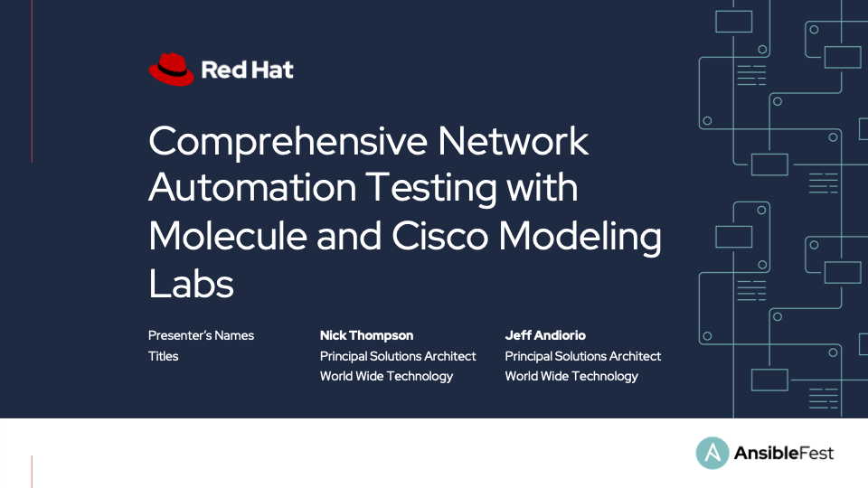
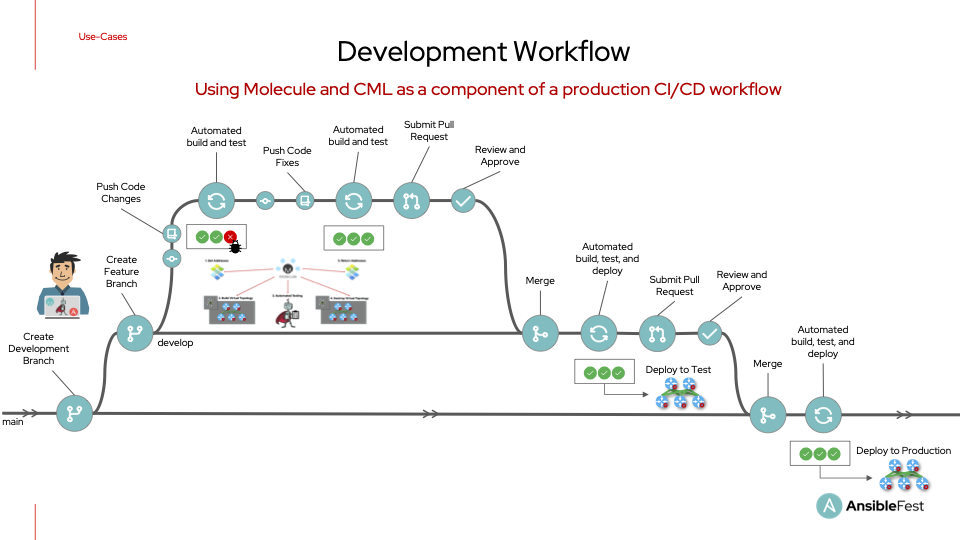
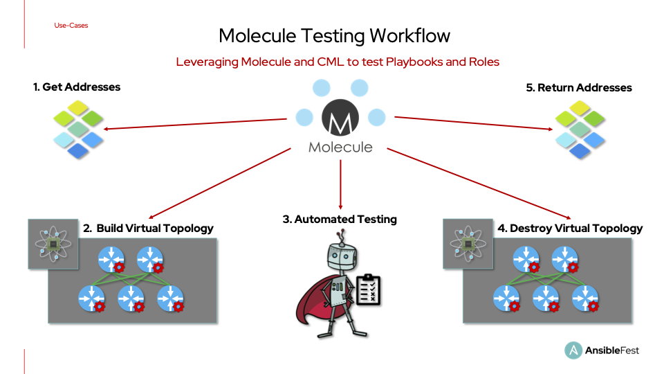
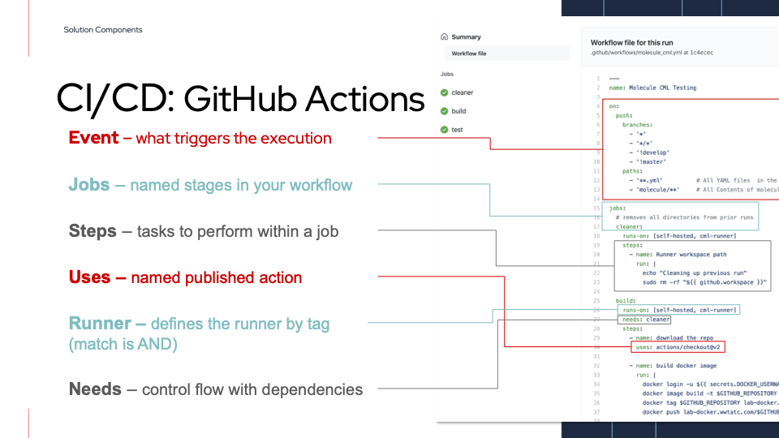

# Comprehensive Network Automation Testing with Molecule and Cisco Modeling Labs



## Overview

This repository serves as an example, and overview of the workflow presented at Ansiblefest 2021, which leverages Ansible, Molecule, and Cisco Modeling Labs combined with Github Actions to provide a modern development lifecycle and testing solution for network automation.

> Note the code in this repository can be used as a reference but will need modifications to work inside your environment.



## Solution Components

The solution presented during Ansiblefest contains the following components.  Below you will find links to the documentation for each.

* [Ansible](https://docs.ansible.com/)
* [Ansible Molecule](https://molecule.readthedocs.io/en/latest/index.html)
* [Cisco Modeling Labs](https://developer.cisco.com/modeling-labs/)
* [Github Actions](https://docs.github.com/en/actions)

## Solution Requirements

* GitHub actions-runner that has access to your lab environment.
* API access to your Infoblox appliances.
* Permissions on the CML instance you are targeting to build a new topology.

## Component Information

### Ansible Molecule

Ansible Molecule is a testing framework that provides the capability to set up, test, and teardown environments your automation targets. Ansible Molecule is a crucial component for testing both Ansible roles and playbooks.

The workflow in the presentation goes through the following steps:

1. Reserving and allocating IP addresses from Infoblox IPAM
2. Building a lab topology in Cisco Modeling Labs
3. Applying device configurations
4. Verifying those configurations match our expectations
5. Tearing down the lab to return resources
6. Returning IP addressing to Infoblox IPAM



You can execute this workflow directly from your development environment or run it automatically by including it in the CI pipeline configured on GitHub.

### GitHub Actions

GitHub Actions provide the Continuous Integration portion to automate Molecule tests based on GitHub repository events.

Below you will find some of the critical elements of the GitHub Actions workflow.  This file can also be found in `./.github/workflows/main.yml`.



The GitHub Action in this repository utilizes a self-hosted actions-runner, which you will need to deploy inside your lab environment.  By deploying this runner in your lab, you will be able to manipulate equipment in the lab through CI automation directly.

> For more information on the actions-runner, you can view the [Github Actions Self-Hosted Runner](https://docs.github.com/en/actions/hosting-your-own-runners/about-self-hosted-runners) documentation.

### Encrypted Secrets and Environment Variables

GitHub repositories allow you to store sensitive data like API keys and passwords by leveraging the Encrypted Secrets feature. In addition, you can reference the values stored in Encrypted Secrets in your GitHub Actions through the use of environment variables.

> For more information on encrypted secrets, you can view the [Github Actions Encrypted Secrets](https://docs.github.com/en/actions/security-guides/encrypted-secrets) documentation.

This lab requires the following Environment Variables.  Some of these variables, such as device usernames and passwords, should be stored as Encrypted Secrets in GitHub to prevent unauthorized access to the credentials.

```environment
export CML_HOSTNAME=[cml_hostname]
export CML_USERNAME=[cml_username]
export CML_PASSWORD=[cml_password]
export CML_SSL_VERIFY=False
export INFOBLOX_HOST=[infoblox_hostname]
export INFOBLOX_USERNAME=[infoblox_username]
export INFOBLOX_PASSWORD=[infoblox_password]
export INFOBLOX_SSL_VERIFY=False
# Ansible Settings
export ANSIBLE_HOST_KEY_CHECKING=False
export ANSIBLE_SSH_PIPELINING=True
```

## Thank You


## Contributors

* Nick Thompson <https://github.com/nsthompson/>
* Jeff Andiorio <https://github.com/jandiorio/>
